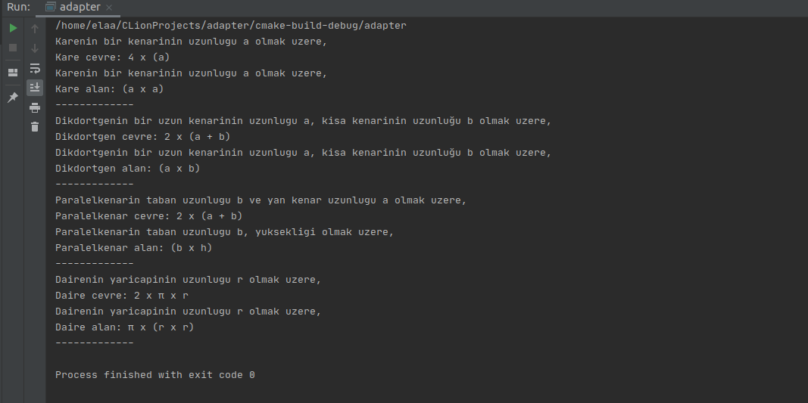

= Adapter Pattern

Adapter pattern, *structural design pattern* kategorisinde yer alır.

Adapter deseni, bir sınıfın interface'ini başka sınıfların onu anlayabilmesi için beklediği başka bir interface'e dönüştürür. Adapter, uyumsuz interface'ler nedeniyle birlikte çalışamayan sınıfların beraber çalışmasına izin verir.

Adapter, bazı nesne türlerini bekleyen bir sınıfımız (Client) ve aynı özellikleri sunan ancak farklı bir arabirimi ortaya çıkaran bir nesnemiz (Adaptee) olduğunda kullanılır.

Client Adapter'i değil, yalnızca hedef interface'i görür. Adapter hedef interface'i uygular. Adapter tüm istekleri Adaptee'ye devreder.

Kullanım amacı:

* Uyumsuz interface’lerin birlikte çalışmasını sağlar.
* Daha önce yazılmış olan kodları düzenlemek zorunda kalmayız. Sonuçta ilgili kodun daha önce çalıştığını kabul ediyoruz.
* Adapte edeceğimiz class üzerinde değişiklik yapmadığımız için uygulama içerisinde kullanılmış olduğu herhangi bir yerde değişiklik yapmamız gerekmez.

== Yapısı 

image::adapter_yapisi.jpg[]

Bir adapter kullanmak için:

. Client hedef arabirimi kullanarak üzerinde bir yöntem çağırarak Adapter'e istekte bulunur.
. Adapter, Adaptee arabirimini kullanarak Adaptee'deki bu isteği çevirir.
. Client çağrının sonuçlarını alır ve Adapter'in varlığından habersizdir.

== Adapter Pattern Örneği

Kodlar:

****
.main.cpp
[source,c++]
----
#include <iostream>
#include <string>
using namespace  std;

class Formul { // <1>
public:
    virtual void cevreFormul() = 0;
    virtual void alanFormul()= 0;
};
// <2>
class Kare : Formul {
public:
    Kare() {};
    void cevreFormul() override {
        cout << "Karenin bir kenarinin uzunlugu a olmak uzere, " << endl;
        cout << ("Kare cevre: 4 x (a)") << endl;
    }
    void alanFormul() override {
        cout << "Karenin bir kenarinin uzunlugu a olmak uzere, " << endl;
        cout << ("Kare alan: (a x a)") << endl;
    }
};
// <2>
class Dikdortgen : Formul {
public:
    Dikdortgen() {};
    void cevreFormul() override {
        cout << "Dikdortgenin bir uzun kenarinin uzunlugu a, kisa kenarinin uzunluğu b olmak uzere, " << endl;
        cout << ("Dikdortgen cevre: 2 x (a + b)") << endl;
    }
    void alanFormul() override {
        cout << "Dikdortgenin bir uzun kenarinin uzunlugu a, kisa kenarinin uzunluğu b olmak uzere, " << endl;
        cout << ("Dikdortgen alan: (a x b)") << endl;
    }
};
// <2>
class Paralelkenar : Formul {
public:
    Paralelkenar() {};
    void cevreFormul() override {
        cout << "Paralelkenarin taban uzunlugu b ve yan kenar uzunlugu a olmak uzere," << endl;
        cout << ("Paralelkenar cevre: 2 x (a + b)") << endl;
    }
    void alanFormul() override {
        cout << "Paralelkenarin taban uzunlugu b, yuksekligi olmak uzere, " << endl;
        cout << ("Paralelkenar alan: (b x h)") << endl;
    }
};

class Daire {
public:
    Daire() {};
    void daireCevre() {
        cout << "Dairenin yaricapinin uzunlugu r olmak uzere, " << endl;
        cout << ("Daire cevre: 2 x π x r ") << endl;
    }
    void daireAlan() {
        cout << "Dairenin yaricapinin uzunlugu r olmak uzere, " << endl;
        cout << ("Daire alan: π x (r x r)") << endl;
    }
};

class DaireAdapter : Formul { // <3>
private:
    Daire daire;
public:
    DaireAdapter(Daire daire){
        this->daire = daire;
    }
    void cevreFormul() override {
        daire.daireCevre();
    }
    void alanFormul() override {
        daire.daireAlan();
    }
};

int main() {
    Kare kare = *new Kare();
    kare.cevreFormul();
    kare.alanFormul();
    cout << ("-------------") << endl;

    Dikdortgen dikdortgen = *new Dikdortgen;
    dikdortgen.cevreFormul();
    dikdortgen.alanFormul();
    cout << ("-------------") << endl;

    Paralelkenar paralelkenar = *new Paralelkenar;
    paralelkenar.cevreFormul();
    paralelkenar.alanFormul();
    cout << ("-------------") << endl;

    Daire daire = *new Daire;

    DaireAdapter daireAdapter = *new DaireAdapter(daire); // <4>
    daireAdapter.cevreFormul();
    daireAdapter.alanFormul();
    cout << ("-------------") << endl;

    return 0;
}
----
<1> Uygulamada kullanılacak metotları belirten bir abstract sınıf tanımlanıyoruz.

<2> Kare, Dikdortgen ve Paralelkenar sınıflarında ortak metodları kullanmak için Formul sınıfı implement ediyoruz. Her sınıf içerisinde cevreFormul() ve alanFormul() metodlarını sınıfların yapısına uygun olarak düzenliyoruz.

<3> Daire sınıfını projeye adapte edebilmek için DaireAdapter adında bir sınıf tanımlıyoruz. Bu sınıf Daire nesnesini barındırarak bu yapıdaki özellik ve metotları Daire nesnesi üzerinden sağlıyor. DaireAdapter sınıfı içinde Formul sınıfını implement edip cevreFormul() ve alanFormul() metodlarını Daire sınıfının kullanacağı şekilde düzenliyoruz. 

<4> Daire sınıfı için de bir nesne oluşturup DaireAdapter nesnesi ile Formul sınıfında tanımlanan metodların bu şekilde kullanılmasını sağlıyoruz. 
****

Proje çalıştıktan sonraki çıktısı:

=== Örneğin UML Diyagramı

.Adapter Pattern PlantUML
[plantuml, adapter , png]      
....
abstract class Formul {
+ virtual void cevreFormul() 
+ virtual void alanformul()
}

class Kare  {
+ Kare()
+ void cevreFormul() 
+ void alanFormul()
}

class Dikdortgen  {
+ Dikdortgen()
+ void cevreFormul() 
+ void alanFormul()
}

class Paralelkenar  {
+ Paralelkenar()
+ void cevreFormul() 
+ void alanFormul()
}

class Daire {
+ Daire() 
+ void daireCevre() 
+ void daireAlan() 
}

class DaireAdapter  {
- Daire daire
+ DaireAdapter(Daire )
+ void cevreFormul()
+ void alanFormul() 
}

Formul <|.. Kare
Formul <|.. Dikdortgen
Formul <|.. Paralelkenar

Formul <|.. DaireAdapter

DaireAdapter --> Daire
....

== Avantajları

* Yeniden kullanılabilirlik ve esneklik elde etmeye yardımcı olur.
* Client sınıfı farklı bir interface kullanmak zorunda olmadığından karmaşık değildir ve farklı adapter uygulamaları arasında geçiş yapmak için polimorfizm kullanabilir.

== Dezavantajları

* Tüm istekler iletilir bu nedenle genel giderde artış olabilir.
* Bazen gerekli olan tipe ulaşmak için bir adapter zinciri boyunca birçok uyarlama gerekebilir.
* Bir dizi yeni arabirim ve sınıf eklemeniz gerektiğinden, kodun genel karmaşıklığı artabilir. 

