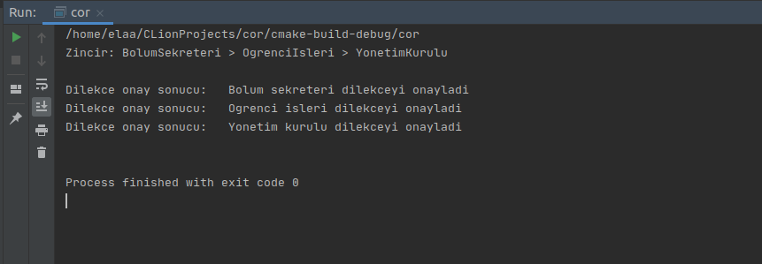

= Chain of Responsibility (CoR- Sorumluluk Zinciri) Pattern 

CoR, *behavioral pattern* kategorisinde yer alır.

CoR, istekleri dinamik bir işleyici (handler) zinciri boyunca sırayla geçirmenizi sağlayan bir tasarım modelidir. 

Desen, işleyicileri bir zincire bağlamanızı önerir. Bağlı her işleyicinin, zincirdeki bir sonraki işleyiciye bir referans depolamak için bir alanı vardır. Bir isteğin işlenmesine ek olarak, işleyiciler isteği zincir boyunca daha ileriye taşır. Bir işleyici, talebi zincirden daha aşağıya geçirmemeye ve daha sonraki işlemleri etkili bir şekilde durdurmamaya da karar verebilir.

İstek tüm işleyiciler onu işleme şansı bulana kadar zincir boyunca hareket eder.

İstek işleme sırasını denetleyebilirsiniz.

CoR modeli ne zaman uygulanabilir:

* Bir isteğin göndericisini ve alıcısını ayırmak istediğinizde
* Çalışma zamanında belirlenen birden fazla nesne, bir isteği ele almaya aday olduğunda
* Kodunuzda açıkça işleyicileri belirtmek istemediğinizde
* Alıcıyı açıkça belirtmeden birkaç nesneden birine istek vermek istediğinizde
* Birden çok nesne bir isteği işleyebiliyorsa ve işleyicinin belirli bir nesne olması gerekmiyorsa 

== Yapısı 

image::cor_yapisi.png[]

*Handler* -> Bu öncelikle isteği alacak ve isteği işleyici zincirine gönderecek bir interface veya abstract class'tır. 

*Client* -> İsteğin kaynağı ve işleyiciyi ele almak için kullanılan sınıftır.

*ConcreteHandler1* / *ConcreteHandler2* -> Bunlar sıralı bir biçimde zincirlenen isteğin işleyicileridir.

== Chain of Responsibility (CoR) Pattern Örneği

Kodlar:

****
.main.cpp
[source,c++]
----
#include <iostream>
#include <vector>

using namespace std;

class Handler { // <1>
public:
    virtual Handler *setSonraki(Handler *handler) = 0;
    virtual string Onaylama(string durum) = 0;
};

class AbstractHandler : public Handler { // <2>
private:
    Handler *sonraki_handler;
public:
    AbstractHandler(){
        this->sonraki_handler = nullptr;
    }
    Handler *setSonraki(Handler *handler) override {
        this->sonraki_handler = handler;
        return handler;
    }
    string Onaylama(string durum) override { 
        if (this->sonraki_handler) {
            return this->sonraki_handler->Onaylama(durum);
        }
        return NULL;
    }
};
// <3>
class BolumSekreteri : public AbstractHandler {  
public:
    string Onaylama(string durum) {
        if (durum == "sekreterOnaylayabilir") {
            return "Bolum sekreteri dilekceyi onayladi";
        } else {
            return AbstractHandler::Onaylama(durum);
        }
    }
};
// <3>
class OgrenciIsleri : public AbstractHandler {
public:
    string Onaylama(string durum) {
        if (durum == "ogrIsleriOnaylayabilir") {
            return "Ogrenci isleri dilekceyi onayladi";
        } else {
            return AbstractHandler::Onaylama(durum);
        }
    }
};
// <3>
class YonetimKurulu : public AbstractHandler {
public:
    string Onaylama(string durum) {
        if (durum == "kurulOnaylayabilir") {
            return "Yonetim kurulu dilekceyi onayladi";
        } else {
            return AbstractHandler::Onaylama(durum);
        }
    }
};

class Ogrenci {  
public:
    void dilekceKontrol (Handler &handler) { // <4>
        vector<string> dilekceDurum = {"sekreterOnaylayabilir", "ogrIsleriOnaylayabilir","kurulOnaylayabilir"};

        for (const string &f : dilekceDurum) {
            string sonuc = handler.Onaylama(f);
            cout << "Dilekce onay sonucu: ";
            if (!sonuc.empty()) {
                cout << "  " << sonuc ;
            } else {
                cout << " Onaylanamadi ";
            }
            cout << "\n";
        }
    }
};

int main() {

    BolumSekreteri *bsekreteri = new BolumSekreteri;
    OgrenciIsleri *oisleri = new OgrenciIsleri;
    YonetimKurulu *ykurulu = new YonetimKurulu;

    bsekreteri->setSonraki(oisleri); // <5>
    oisleri->setSonraki(ykurulu);

    cout << "Zincir: BolumSekreteri > OgrenciIsleri > YonetimKurulu \n\n";

    Ogrenci *ogrenci = new Ogrenci;

    ogrenci->dilekceKontrol(*bsekreteri); // <6>
    cout << "\n";

    delete bsekreteri;
    delete oisleri;
    delete ykurulu;

    return 0;
}
----
<1>  Zincir yapısı boyunca kullanılacak metotları belirten bir abstract sınıf tanımlanıyoruz.

<2> Metotları işleyicilerde kullanmak ve içlerini doldurmak üzere Handler sınıfını implement ediyoruz. setSonraki() metodunu çağrıldığı yerdeki Handler nesnesini bir sonraki işleyici olarak ayarlayacak şekilde düzenliyoruz. Onaylama() metodunu ise, eğer zincirde kullanılan işleyici sonrasında başka bir işleyici gelirse alınan dilekçe durumunu o işleyiciye gönderecek şekilde düzenliyoruz.

<3> BolumSekreteri, OgrenciIsleri ve YonetimKurulu sınıflarını işleyici (ConcreteHandlers örnekleri) olarak kullanmak için AbstractHandler sınıfı extends ediyoruz. Her sınıf içinde Onaylama() metodunu sınıfın yapısına uygun olarak düzenliyoruz.

<4> Client olarak kullanılmak üzere Ogrenci adında bir sınıf tanımlıyoruz. Burada dilekceKontrol() metodunda Handler nesnesini kullanarak dilekçe durumunun işleyiciler arasında kontrolünü yapıyoruz.

<5> Burada oluşturulan her işleyici için sonrasında gelecek olan işleyiciyi setSonraki() metodu ile belirterek bir işlem zinciri oluşturuyoruz.

<6> Ogrenci sınıfa ait bir nesne oluşturup sonrasında oluşturduğumuz zincirdeki ilk işleyiciyi dilekceKontrol() metoduna gönderiyoruz. 
****

Proje çalıştıktan sonraki çıktısı:

=== Örneğin UML Diyagramı

.CoR Pattern PlantUML
[plantuml, cor , png]      
....
abstract class Handler {
+ virtual Handler *setSonraki(Handler*)
+ virtual string Onaylama(string)
}

class AbstractHandler {
- Handler *sonraki_handler;
+ AbstractHandler()
+ Handler *setSonraki(Handler*)  
+ string Onaylama(string)  
}

class BolumSekreteri { 
+ string Onaylama(string) 
}

class OgrenciIsleri { 
+ string Onaylama(string) 
}

class YonetimKurulu { 
+ string Onaylama(string) 
}

class Ogrenci { 
+ void dilekceKontrol (Handler&) 
}

Handler --o AbstractHandler
Handler <|.. AbstractHandler
BolumSekreteri ..|> AbstractHandler
OgrenciIsleri ..|> AbstractHandler
YonetimKurulu ..|> AbstractHandler
Ogrenci --> Handler
....

== Avantajları

* Basitleştirilmiş nesne. Nesnenin zincir yapısını bilmesi gerekmez.
* Nesneye atanan görevlerin esnekliğini artırın. Zincir içindeki üyeleri değiştirerek veya sıralarını değiştirerek, dinamik ekleme veya silme sorumluluğuna izin verin.

== Dezavantajları

* İsteğin garanti kapsamında olmaması gerekir.
* Sistemin performansı etkilenecektir ancak kod hata ayıklamasında da kolay değildir, döngü çağrısına neden olabilir.
* Hata ayıklama nedeniyle operasyonun özelliklerini gözlemlemek kolay olmayabilir.
* Bazı istekler ele alınmayabilir.
