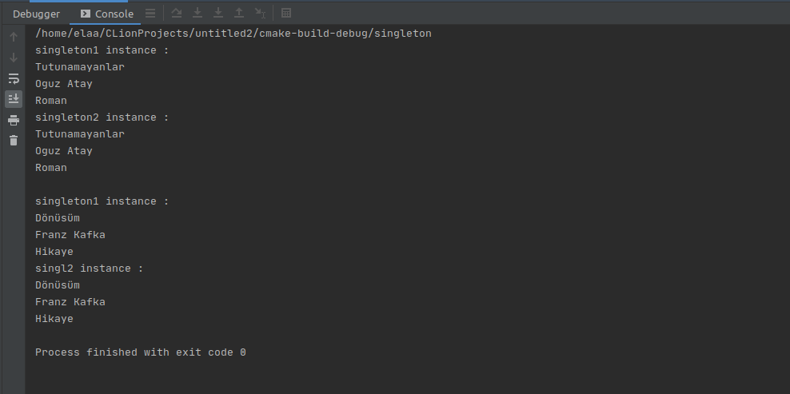

= Singleton Pattern 

Singleton design pattern, *creational design pattern* kategorisinde yer alır.

Bu tasarım örüntüsündeki amaç, bir class'tan bir instance yaratılmasını sağlar. Yani herhangi bir class'tan bir instance yaratılmak istendiğinde, eğer daha önceden yaratılmış bir instance yoksa yeni yaratılır. Daha önce yaratılmış instance var ise var olan instance kullanılır.

Aynı instance üzerinden işlem yapabilmeyi sağlamak için Singleton pattern kullanılıyor.

Tek bir nesneye ihtiyaç duyulan zamanlarda bu pattern kullanılır.

== Yapısı 

image::singleton_yapisi.png[]

Bir class'ın Singleton tasarım örüntüsüne sahip olması için temelde üç şey gereklidir:

* private constructor
* private static değişken
* public static method

== Singleton Pattern Örneği

Kodlar:

****
.singleton.cpp
[source,c++]
----
#include <iostream>
using namespace std;

class Kitaplar {
private:
    static Kitaplar *kitapOrnek; // <1>
    string isim;
    string kategori;
    string yazar;

    Kitaplar(){  // <2>
        isim="Tutunamayanlar";
        kategori="Roman";
        yazar="Oguz Atay";
    }

private:;
    ~Kitaplar(){ };

public:
    static Kitaplar *getKitaplarOrnek() // <3>
    {
        if (kitapOrnek == NULL){
            kitapOrnek = new Kitaplar();
        }
        return kitapOrnek;
    }
    string getIsim(){
        return this->isim;
    }
    void setIsim(string i){
        isim=i;
    }
    string getKategori()  {
        return this->kategori;
    }
    void setKategori( string k) {
        kategori = k;
    }
    string getYazar()  {
        return yazar;
    }
    void setYazar(string y) {
        yazar = y;
    }
};

Kitaplar* Kitaplar::kitapOrnek = NULL;

int main()
{
    Kitaplar *singl1 = Kitaplar::getKitaplarOrnek();
    Kitaplar *singl2 = Kitaplar::getKitaplarOrnek();

    cout << "singleton1 instance :" << endl;
    cout << singl1->getIsim() << endl;
    cout << singl1->getYazar() << endl;
    cout << singl1->getKategori() << endl;

    cout << "singleton2 instance :" << endl;
    cout << singl2->getIsim() << endl;
    cout << singl2->getYazar() << endl;
    cout << singl2->getKategori() << endl;

    singl1->setIsim("Dönüsüm");
    singl1->setYazar("Franz Kafka"); // <4>
    singl1->setKategori("Hikaye");

    cout <<  endl;
    cout << "singleton1 instance :" << endl;
    cout << singl1->getIsim() << endl;
    cout << singl1->getYazar() << endl;
    cout << singl1->getKategori() << endl;

    cout << "singl2 instance :" << endl;
    cout << singl2->getIsim() << endl;
    cout << singl2->getYazar() << endl;
    cout << singl2->getKategori() << endl;
}
----
<1> Sınıfla aynı türde bir private static bir değişken tanımlıyoruz. Nesnenin daha önceden oluşturulmadığını anlayabilmek için static olarak tanımlıyoruz.  

<2> Sınıfa ait constructor metodunu private tanımlıyoruz. Bu şekilde new ile yeni nesne oluşturulmasını engellemiş oluyoruz.

<3> Static değişkene ulaşmak için bu metodu tanımlıyoruz. Eğer daha önce instance oluşturulmamış ise sınıfa ait tek instance'ın oluşturulmasını sağlıyoruz. Instance'ları new ile yaratmıyoruz. Bunun yerine getKitaplarOrnek() metodunu kullanıyoruz. Metot her defasında aynı çıktıyı veriyor. Ayrıca metot çağrılana kadar da instance yaratılmıyor.

<4> getKitaplarOrnek metodunun aynı çıktıyı verip vermediğini kontrol etmek için örneklerin birinde değişiklik yapıp sonrasında örnekleri kontrol ediyoruz.
****

Proje çalıştıktan sonraki çıktısı:

=== Örneğin UML Diyagramı

.Singleton Pattern PlantUML
[plantuml, singleton , png]      
....
class Kitaplar {
- {static} Kitaplar *kitapOrnek
- string isim
- string kategori
- string yazar

- Kitaplar()
- ~Kitaplar()

+ {static} Kitaplar *getKitaplarOrnek() 
+ string getIsim()
+ void setIsim(string)
+ string getKategori()  
+ void setKategori(string)
+ string getYazar()  
+ void setYazar(string)
}
....

